# 📋 INFORME TÉCNICO: PROYECTO GESTORPRO PERSONAL

## 🎯 RESUMEN EJECUTIVO

GestorPro Personal es un sistema de gestión empresarial modular construido con Node.js/Express y PostgreSQL, diseñado para administrar órdenes de trabajo y servidores/infraestructura empresarial. El sistema utiliza contenedores Docker para facilitar el desarrollo y despliegue, con una arquitectura limpia y escalable.

---

## � INFORME DE ACTUALIZACIÓN (2025-11-14)

### 1) Estado Actual

- Progreso general: 70% completado
- Hitos alcanzados desde el último informe:
  - Corrección total de errores de tipado en `frontend/src/main.js` y verificación con TypeScript (sin errores).
  - Build de frontend exitoso con Vite; artefactos optimizados en `frontend/dist/`.
  - Inicio y estabilización de los servicios de desarrollo: frontend (`5173`), backend (`3000`) y base de datos (`5432`).
  - Implementación de reintentos con backoff en fetch de API y mejora UX (silenciar logs fuera de contexto).
  - Ampliación del módulo Servidores para registrar redes VPN (Radmin) y Tailscale, con nuevos campos en UI y soporte en API.
  - Manejo de errores robusto en rutas del backend para evitar caídas por fallos de BD.
- Problemas técnicos identificados y estado:
  - `ERR_CONNECTION_REFUSED` al iniciar: resuelto levantando Postgres con Docker y añadiendo manejo de errores.
  - Tipado en JS con `checkJs`: resuelto con anotaciones JSDoc y utilidades de casting.
  - UX: logs ruidosos fuera de la pestaña activa: mitigado.
- Cambios significativos en requisitos/alcance:
  - Inclusión de registro de dos redes de VPN (Radmin y Tailscale) en el módulo Servidores, con almacenamiento de credenciales y configuración.

### 2) Datos Técnicos Actualizados

- Métricas de rendimiento relevantes:
  - Build Vite: `dist/index.html 4.54 kB (gzip 1.29 kB)`, `dist/assets/index.css 4.31 kB (gzip 1.42 kB)`, `dist/assets/index.js 47.13 kB (gzip 9.64 kB)`; tiempo de build ~896ms.
  - TypeScript: `npx tsc --noEmit` sin errores.
  - Servidores activos: Frontend `http://localhost:5173/`, Backend `http://localhost:3000/`.
- Resultados de pruebas recientes:
  - Verificación manual de endpoints y carga inicial de datos mediante UI; reintentos con backoff reducen fallos transitorios.
  - Error de conexión a BD reproducido y mitigado con Docker Compose y `try/catch` en rutas.
- Diagramas de arquitectura (actualizados):

```mermaid
graph TD
    A[Frontend Vite + Vanilla JS] --> B[API Fetch + Backoff]
    B --> C[Express Server]
    C --> D[PostgreSQL Pool]
    D --> E[DB (ordenes_trabajo, items_venta, pagos, servidores)]
    A --> F[UI Tailwind + Lucide]
    C --> G[/ordenes, /items, /pagos, /servidores]
```

- Dependencias y versiones (actuales):
  - Frontend: `vite ^5.0.0`, `typescript ^5.9.3`, `tailwindcss ^3.3.0`, `postcss ^8.4.0`, `autoprefixer ^10.4.0`; `lucide` por CDN.
  - Backend: `express ^4.18.2`, `pg ^8.11.3`, `cors ^2.8.5`, `dotenv ^16.4.5`, `nodemon ^3.0.1`.
  - Infraestructura: Docker Compose; `postgres:16`, `dpage/pgadmin4:8`.
  - Variables de entorno (backend/.env): `POSTGRES_HOST`, `POSTGRES_USER`, `POSTGRES_PASSWORD`, `POSTGRES_DB`, `POSTGRES_PORT`, `APP_PORT`.

Referencias cruzadas (código):
- `frontend/src/main.js:14` base URL de API.
- `frontend/src/main.js:55` implementación de `fetchWithRetry`.
- `frontend/src/main.js:691` silenciamiento de log en `renderOrdenesTable`.
- `backend/src/server.js:20` puerto de aplicación.
- `backend/src/routes/servidores.js:7` manejo de errores en listado de servidores.
- `backend/src/routes/servidores.js:22` creación con validación y `201`.

### 3) Análisis Comparativo

- Diferencias vs plan original:
  - Frontend previsto con React; estado actual usa Vanilla JS empaquetado con Vite. Razón: acelerar entrega y simplificar stack.
  - Módulo Servidores expandido para cubrir Radmin/Tailscale, no contemplado en el alcance inicial.
- Desviaciones de cronograma y presupuesto:
  - Cronograma: leve desviación por resolución de infraestructura (BD y manejo de errores);
  - Presupuesto: no incrementos significativos; uso de Docker y librerías OSS.
- Impacto técnico:
  - Menor complejidad en frontend; facilidad para migrar a React más adelante.
  - Mayor resiliencia de la API por reintentos y `try/catch` en rutas.
  - Seguridad: necesidad de manejo sólido de credenciales en Servidores (evitar exposición, cifrado en repositorio y en tránsito).

### 4) Recomendaciones

- Acciones técnicas prioritarias:
  - Extender reintentos con backoff a `postData`, `putData`, `deleteData` y añadir `healthcheck` (/health) en backend.
  - Validaciones de UI: IP (Radmin), JSON (`tailscale_config`) y campos obligatorios por tipo de conexión.
  - Añadir script de lint y CI para TypeScript y build.
  - Instrumentar logs estructurados y niveles (INFO/ERROR) con correlación de petición.
- Ajustes en estrategia de implementación:
  - Mantener Vanilla JS mientras se completa funcionalidad; planificar migración a React en una rama futura.
  - Estandarizar variables de entorno (usar prefijo `POSTGRES_` conforme a `backend/src/db.js:7–13`).
- Riesgos y mitigación:
  - Gestión de secretos (emails/contraseñas): emplear cifrado y ocultación (variables de entorno, vaults, no almacenar en texto plano).
  - Disponibilidad de BD: usar `docker compose` con políticas de reinicio y `readiness probes`.
  - Cambios de alcance: documentar en `/docs/` y versionar migraciones.

Evidencias documentadas:
- Build exitoso (ver salida de Vite en `frontend/dist/`).
- TypeScript sin errores de tipado.
- Código de reintentos y mejoras UX en `frontend/src/main.js`.
- Rutas Servidores con manejo de errores en `backend/src/routes/servidores.js`.

---

## �📁 1. JERARQUÍA DE DIRECTORIOS Y ARCHIVOS

```
gestorpro/
├── backend/                          # Aplicación Express.js
│   ├── src/
│   │   ├── db.js                     # Configuración de conexión PostgreSQL
│   │   ├── server.js                 # Punto de entrada del servidor Express
│   │   └── routes/                   # Rutas de la API REST
│   │       ├── ordenes.js           # CRUD de órdenes de trabajo
│   │       ├── items.js             # Gestión de items de venta
│   │       ├── pagos.js             # Control de pagos
│   │       └── servidores.js        # Nuevo módulo de infraestructura
│   ├── .env                          # Variables de entorno
│   ├── package.json                  # Dependencias y scripts
│   └── package-lock.json            # Versiones exactas de dependencias
├── db/                              # Base de datos y migraciones
│   ├── init/
│   │   ├── 01_schema.sql            # Esquema inicial del sistema
│   │   └── 02_seed.sql              # Datos de prueba iniciales
│   ├── migrations/                  # Migraciones versionadas
│   │   ├── 03_migration_servidores.sql
│   │   └── 03_rollback_servidores.sql
│   └── backups/                     # Backups de seguridad
│       ├── gestorpro_backup_.sql
│       └── gestorpro_backup_20251111_235009.sql
├── docs/                            # Documentación técnica
│   ├── CONFIG_SERVIDORES.md         # Configuración del módulo servidores
│   ├── GUIA_EQUIPO_SERVIDORES.md    # Guía de uso para el equipo
│   ├── MIGRATION_REPORT_SERVIDORES.md # Reporte de migración
│   └── INFORME_TECNICO_COMPLETO.md  # Este documento
└── docker-compose.yml               # Orquestación de contenedores
```

---

## 🔧 2. COMPONENTES PRINCIPALES Y FUNCIONES

### 2.1 Backend Express.js
**Propósito:** API REST que gestiona toda la lógica de negocio
**Ubicación:** `backend/src/server.js`

**Funciones principales:**
- Servir endpoints REST para todas las entidades
- Validación de datos entrantes
- Cálculos automáticos (totales, ganancias, saldos)
- Gestión de errores y respuestas HTTP

### 2.2 Base de datos PostgreSQL
**Propósito:** Almacenamiento persistente y relacional de datos
**Ubicación:** Servicio Docker `gestorpro_db`

**Características:**
- Uso de UUID como identificadores primarios
- Campos JSONB para estructuras flexibles
- Cálculos automáticos con `GENERATED ALWAYS`
- Índices optimizados para búsquedas

### 2.3 Docker Compose
**Propósito:** Orquestación de servicios y entorno de desarrollo
**Ubicación:** `docker-compose.yml`

**Servicios:**
- PostgreSQL: Base de datos principal
- pgAdmin: Interfaz administrativa web
- Backend Node.js: API REST

### 2.4 Sistema de Migraciones
**Propósito:** Control versionado de cambios en esquema
**Ubicación:** `db/migrations/`

**Beneficios:**
- Cambios trazables y reversibles
- Scripts de rollback automáticos
- Documentación de cada modificación

---

## 🔄 3. DIAGRAMA DE DEPENDENCIAS ENTRE MÓDULOS

```mermaid
graph TD
    A[Cliente HTTP] --> B[Express Router]
    B --> C[Controladores]
    C --> D[Servicios de Negocio]
    D --> E[PostgreSQL Pool]
    E --> F[Tablas: ordenes_trabajo]
    E --> G[Tablas: items_venta]
    E --> H[Tablas: pagos]
    E --> I[Tablas: servidores]
    
    F --> J[Cálculos automáticos]
    G --> J
    H --> J
    
    K[Docker Compose] --> L[PostgreSQL Container]
    K --> M[pgAdmin Container]
    K --> N[Backend Container]
    
    style A fill:#e1f5fe
    style I fill:#c8e6c9
    style K fill:#fff3e0
```



---

## 💻 4. TECNOLOGÍAS Y FRAMEWORKS UTILIZADOS

### Backend
- **Node.js 24.11.0** - Runtime de JavaScript
- **Express.js 4.18.2** - Framework web minimalista
- **PostgreSQL** - Sistema de gestión de bases de datos relacionales
- **pg (node-postgres)** - Cliente PostgreSQL para Node.js
- **dotenv** - Gestión de variables de entorno
- **cors** - Control de acceso entre domininos
- **nodemon** - Reinicio automático en desarrollo

### Frontend (Preparado para futura integración)
- **React 18** - Framework de interfaz de usuario
- **Vite** - Herramienta de construcción rápida
- **TailwindCSS** - Framework de estilos utilitarios

### Infraestructura
- **Docker & Docker Compose** - Contenerización y orquestación
- **pgAdmin** - Herramienta administrativa de PostgreSQL
- **UUID v4** - Identificadores únicos universales

---

## ⚙️ 5. CONFIGURACIONES CLAVE DEL PROYECTO

### Variables de Entorno (backend/.env)
```bash
# Conexión PostgreSQL
DB_HOST=localhost
DB_PORT=5432
DB_NAME=gestorpro
DB_USER=admin
DB_PASSWORD=admin123

# Servidor Express
PORT=3000
NODE_ENV=development
```

### Configuración Docker Compose
```yaml
# Servicios principales
services:
  postgres:
    image: postgres:16
    container_name: gestorpro_db
    ports: ["5432:5432"]
    environment:
      POSTGRES_DB: gestorpro
      POSTGRES_USER: admin
      POSTGRES_PASSWORD: admin123
    volumes:
      - ./db/init:/docker-entrypoint-initdb.d
      - postgres_data:/var/lib/postgresql/data

  pgadmin:
    image: dpage/pgadmin4:8
    container_name: gestorpro_pgadmin
    ports: ["5050:80"]
    environment:
      PGADMIN_DEFAULT_EMAIL: admin@gestorpro.com
      PGADMIN_DEFAULT_PASSWORD: admin123
```

### Configuración de Conexión (backend/src/db.js)
```javascript
import pg from 'pg';
import dotenv from 'dotenv';

dotenv.config();

const pool = new pg.Pool({
  host: process.env.DB_HOST,
  port: parseInt(process.env.DB_PORT),
  database: process.env.DB_NAME,
  user: process.env.DB_USER,
  password: process.env.DB_PASSWORD,
  max: 20,        // Máximo de conexiones
  idleTimeoutMillis: 30000,
  connectionTimeoutMillis: 2000,
});
```

---

## 🚀 6. FLUJOS DE TRABAJO PRINCIPALES

### 6.1 Flujo de Desarrollo
```
1. docker compose up -d              # Iniciar servicios
2. cd backend && npm install         # Instalar dependencias
3. npm run dev                       # Desarrollo con hot-reload
4. Pruebas en http://localhost:3000  # Verificar endpoints
5. pgAdmin en http://localhost:5050  # Administrar base de datos
```

### 6.2 Flujo de Datos - Órdenes de Trabajo
```
Cliente → POST /ordenes → Crear orden con código único
Cliente → POST /items/:ordenId → Agregar items
Cliente → POST /pagos/:ordenId → Registrar pagos
Sistema → Recalcular automáticamente totales y ganancias
Cliente → GET /ordenes/:id → Consultar orden actualizada
```

### 6.3 Flujo de Datos - Servidores
```
Cliente → POST /servidores → Crear registro de servidor
Cliente → GET /servidores → Listar todos los servidores
Cliente → PUT /servidores/:id → Actualizar información
Cliente → DELETE /servidores/:id → Eliminar registro
```

### 6.4 Flujo de Deployment
```
1. Verificar variables de entorno en producción
2. Ejecutar migraciones: npm run migrate
3. Construir imagen Docker: docker build -t gestorpro .
4. Desplegar contenedores con docker-compose.prod.yml
5. Verificar logs y monitorear salud del sistema
```

---

## 🗄️ 7. ESTRUCTURA DE LA BASE DE DATOS

### Diagrama Entidad-Relación
```mermaid
erDiagram
    ORDENES_TRABAJO ||--o{ ITEMS_VENTA : "contiene"
    ORDENES_TRABAJO ||--o{ PAGOS : "recibe"
    SERVIDORES ||--o{ USUARIOS_SERVIDOR : "tiene"
    
    ORDENES_TRABAJO {
        UUID id PK
        VARCHAR codigo UK
        TEXT cliente
        TEXT detalle
        DATE fecha_servicio
        VARCHAR estado
        VARCHAR prioridad
        NUMERIC total_venta
        NUMERIC total_costo
        NUMERIC ganancia
        NUMERIC saldo_pendiente
        TIMESTAMP created_at
    }
    
    ITEMS_VENTA {
        UUID id PK
        UUID orden_id FK
        TEXT descripcion
        INTEGER cantidad
        NUMERIC precio_unitario
        NUMERIC costo_unitario
        NUMERIC total
    }
    
    PAGOS {
        UUID id PK
        UUID orden_id FK
        NUMERIC monto
        VARCHAR metodo
        DATE fecha
    }
    
    SERVIDORES {
        UUID id PK
        TEXT empresa
        TEXT nombre_servidor
        TEXT vpn_nombre
        TEXT vpn_contraseña
        TEXT vpn_ip
        JSONB usuarios
        TEXT tailscale_tnet
        JSONB tailscale_config
        TEXT email_despliegue
        TEXT password_despliegue
        TIMESTAMP created_at
    }
```

### Índices y Optimizaciones
```sql
-- Índices para búsquedas frecuentes
CREATE INDEX idx_ordenes_cliente ON ordenes_trabajo(cliente);
CREATE INDEX idx_ordenes_estado ON ordenes_trabajo(estado);
CREATE INDEX idx_ordenes_fecha ON ordenes_trabajo(created_at DESC);
CREATE INDEX idx_servidores_empresa ON servidores(empresa);
CREATE INDEX idx_servidores_nombre ON servidores(nombre_servidor);
```

---

## 🏗️ 8. ARQUITECTURA GENERAL DEL SISTEMA

### Arquitectura de Tres Capas
```
┌─────────────────────────────────────────┐
│           CAPA DE PRESENTACIÓN            │
│  (Futuro: React/Vue + TailwindCSS)    │
├─────────────────────────────────────────┤
│            CAPA DE LÓGICA               │
│         Express.js + REST API           │
│  ┌─────────────┬──────────┬──────────┐ │
│  │  Órdenes    │  Items   │ Servidores│ │
│  │  de Trabajo │  Venta   │Infraest.  │ │
│  └─────────────┴──────────┴──────────┘ │
├─────────────────────────────────────────┤
│           CAPA DE DATOS                 │
│         PostgreSQL + JSONB              │
│  ┌─────────────┬──────────┬──────────┐ │
│  │ordenes_trabajo│items_venta│servidores│ │
│  └─────────────┴──────────┴──────────┘ │
└─────────────────────────────────────────┘
```

### Principios de Diseño Aplicados

1. **Separación de Responsabilidades**
   - Rutas → Controladores → Servicios → Base de Datos
   - Cada módulo es independiente y desacoplado

2. **Principio DRY (Don't Repeat Yourself)**
   - Reutilización de conexiones de base de datos
   - Funciones compartidas para cálculos comunes

3. **Configuración por Entorno**
   - Variables de entorno para diferentes etapas
   - Scripts separados para desarrollo y producción

4. **Documentación Exhaustiva**
   - README por módulo
   - Comentarios en código
   - Diagramas de flujo y arquitectura

### Convenciones del Proyecto

**Nomenclatura:**
- Tablas: `snake_case` plural (ej: `ordenes_trabajo`)
- Campos: `snake_case` (ej: `nombre_servidor`)
- Archivos: `kebab-case` (ej: `servidores.js`)
- Variables: `camelCase` (ej: `totalVenta`)

**Estandares de Código:**
- ES6 Modules (`import`/`export`)
- Async/Await para operaciones asíncronas
- Validación de datos antes de inserciones
- Manejo de errores con try/catch
- Respuestas JSON consistentes

---

## 📈 ESTADO ACTUAL Y PRÓXIMOS PASOS

### ✅ Módulos Completos
- **Órdenes de Trabajo**: CRUD completo con cálculos automáticos
- **Items de Venta**: Gestión con recálculo de totales
- **Pagos**: Control con actualización de saldos
- **Servidores/Infraestructura**: Nuevo módulo operativo

### 🔄 En Desarrollo
- Interfaz de usuario web (React + TailwindCSS)
- Sistema de autenticación y autorización
- Dashboard con métricas y reportes
- Exportación de datos a Excel/PDF

### 🚀 Próximas Integraciones
- Notificaciones por email
- Integración con servicios cloud
- API para aplicaciones móviles
- Sistema de backup automático

---

## 📞 SOPORTE Y MANTENIMIENTO

**Documentación Adicional:**
- Consultar archivos en `/docs/` para guías específicas
- Revisar comentarios en código para detalles de implementación
- Utilizar pgAdmin para administración visual de base de datos

**Procedimientos de Emergencia:**
1. **Backup**: Ejecutar script en `db/backups/`
2. **Rollback**: Usar migraciones en `db/migrations/`
3. **Logs**: Verificar salida de contenedores Docker
4. **Restauración**: Aplicar backup más reciente

---

**✅ INFORME TÉCNICO COMPLETO - GESTORPRO PERSONAL**
*Última actualización: Noviembre 2024*
*Versión del sistema: 2.0.0 (con módulo de servidores)*
